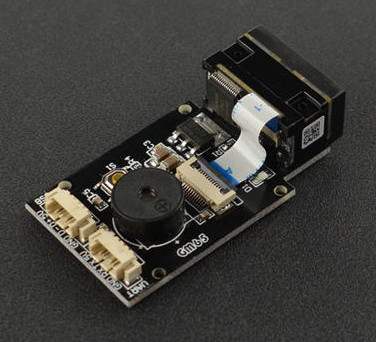
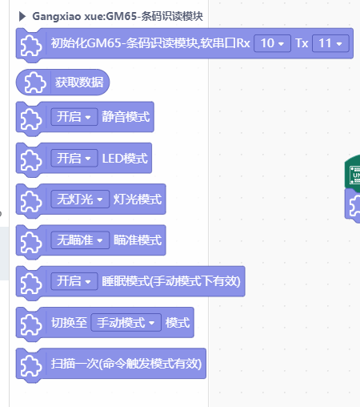
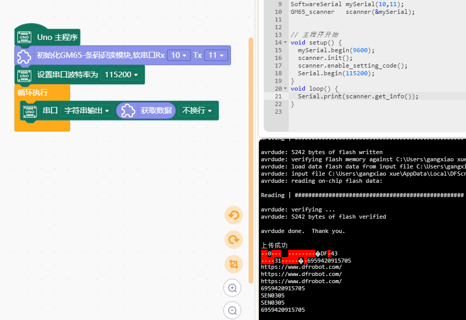

# GM65_scanner for mind+




---------------------------------------------------------

## 目录

* [相关链接](#相关链接)
* [描述](#描述)
* [积木列表](#积木列表)
* [示例程序](#示例程序)
* [许可证](#许可证)
* [支持列表](#支持列表)
* [更新记录](#更新记录)

## 相关链接
* 本项目加载链接: ```https://github.com/xuegangxiao0117/GM65_scanner_for_mindplus```

* 用户库教程链接: ```https://mindplus.dfrobot.com.cn/extensions-user```

* 购买此产品: [商城](https://www.dfrobot.com.cn/).

## 描述
GM65-条码识读模块

## 积木列表




## 示例程序



## 许可证

MIT

## 支持列表

aruidno UNO


## 更新日志
* V0.0.1  基础功能完成
